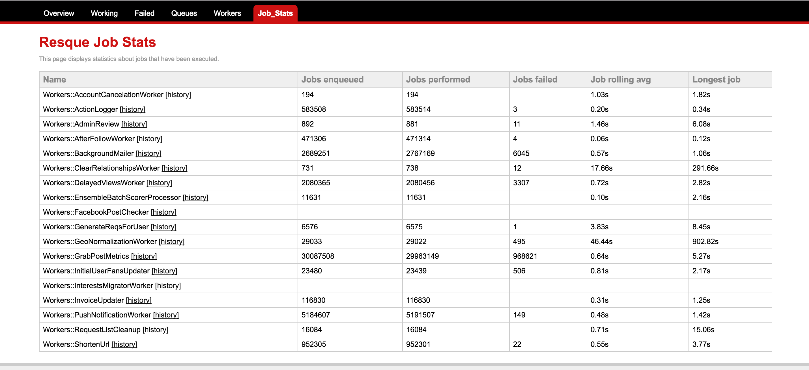
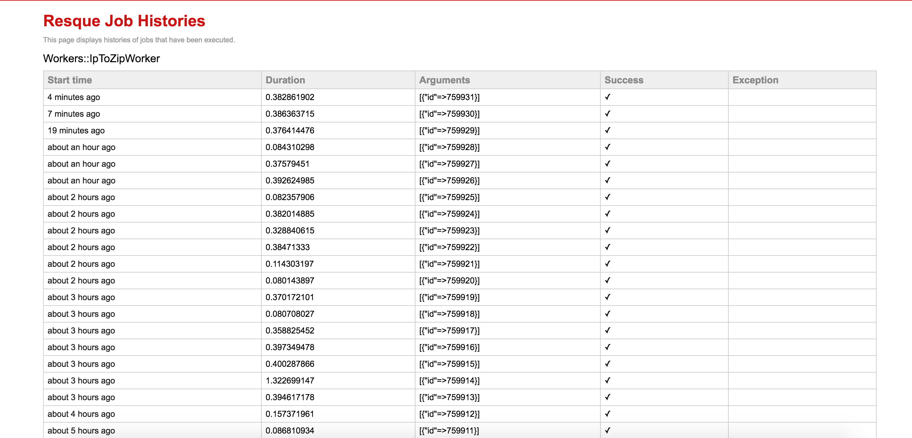

# resque-job-stats

[](http://travis-ci.org/alanpeabody/resque-job-stats)

Job centric stats for Resque.

Stats are tracked per Job type (class/module) in addition to the worker based stats Resque provides.

Stats tracked are:

* Jobs performed
* Jobs enqueued
* Jobs failed
* Duration of last x jobs completed
* Average job duration over last 100 jobs completed
* Longest job duration over last 100 jobs completed
* Jobs enqueued as timeseries data (minute, hourly)
* Jobs performed as timeseries data (minute, hourly)

This information can be used to help track performance and diagnose specific bottlenecks.

We are sending this information to Nagios for graphing and alerts (via a custom rake task).

## Installation

Requires resque '~> 1.17.0'

In your Gemfile add:

```ruby
gem 'resque-job-stats'
```

## Usage

Simply extend your class

```ruby
class MyJob
  extend Resque::Plugins::JobStats

  @queue = :my_job
  def self.perform(*args)
    # ..
  end
end
```

And you will have a set of keys starting with `'stats:jobs:my_job'` inside your Resque redis namespace.

Alternatively you can include just the metric you wish to record.

```ruby
class MyVerboseJob
  extend Resque::Plugins::JobStats::Performed
  extend Resque::Plugins::JobStats::Enqueued
  extend Resque::Plugins::JobStats::Failed
  extend Resque::Plugins::JobStats::Duration
  extend Resque::Plugins::JobStats::Timeseries::Enqueued
  extend Resque::Plugins::JobStats::Timeseries::Performed

  @queue = :my_job
  def self.perform(*args)
    # ...
  end
end
```

### Duration module

The duration module provides two metrics, the longest job and the job rolling avg.

These are accessible via two singleton methods, `MyJob.job_rolling_avg` and `MyJob.longest_job`.

By default the last 100 jobs durations are stored and used to provide the above metrics.

You may set the number of jobs to include by setting the `@durations_recorded` variable.


```ruby
class MyJob
  extend Resque::Plugins::JobStats::Duration

  @queue = :my_job
  @durations_recorded = 1000

  def self.perform(*payload)
    # ...
  end
end
```

### Timeseries module

The timeseries module provides timeseries counts of jobs performed. The metrics are rolling and kept for a period of time before being expired.
The timestamp used for the timeseries data is UTC.

## Resque Web Tab

The Resque web page for showing the statistics will only display jobs that extend Resque::Plugins::JobStats (in other words, just
the jobs that include all of the metrics):

```ruby
class MyJob
  extend Resque::Plugins::JobStats
  ...
end
```

The interface can be included in your app like this:

```ruby
require 'resque-job-stats/server'
```

If you wish to display only certain metrics, you can filter the metrics accordingly.  The default metrics can be found in Resque::Plugins::JobStats::Statistic.

```ruby
  Resque::Server.job_stats_to_display = [:jobs_enqueued, :job_rolling_avg]
```

## Screenshots

### Overview



### Individual Job Histories



## TODO

* Find clean way to add queue wait time stats.

## Contributing to resque-job-stats

* Check out the latest master to make sure the feature hasn't been implemented or the bug hasn't been fixed yet
* Check out the issue tracker to make sure someone already hasn't requested it and/or contributed it
* Fork the project
* Start a feature/bugfix branch
* Commit and push until you are happy with your contribution
* Make sure to add tests for it. This is important so I don't break it in a future version unintentionally.
* Please try not to mess with the Rakefile, version, or history. If you want to have your own version, or is otherwise necessary, that is fine, but please isolate to its own commit so I can cherry-pick around it.

## Contributers

* [damonmorgan](https://github.com/damonmorgan)
* [unclebilly](https://github.com/unclebilly)

## Copyright

Copyright (c) 2011-2012 Alan Peabody. See LICENSE.txt for further details.

